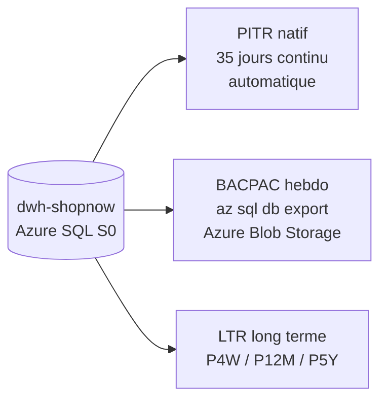

# Situation 7.3 — DRP & Backups

## Contexte

Azure SQL Database S0 est le cœur du DWH ShopNow. Une perte de données ou une
indisponibilité prolongée impacte directement les vendeurs et les analyses financières.

## Objectifs DRP

| Indicateur | Cible | Mécanisme |
|------------|-------|-----------|
| RPO (perte max acceptable) | < 15 minutes | PITR natif Azure SQL toutes les 5-12 min |
| RTO (temps de restauration max) | < 2 heures | Restauration PITR depuis portail ou CLI |

## Architecture de sauvegarde



## Scénarios de restauration

| Scénario | Mécanisme | RTO estimé |
|----------|-----------|------------|
| Suppression accidentelle (< 35j) | PITR — `az sql db restore` | 30-60 min |
| Corruption logique récente | PITR — point précis avant incident | 30-60 min |
| Restauration inter-environnement | BACPAC — `az sql db import` | 45-90 min |
| Perte région Azure complète | LTR + recréation Terraform | < 4h |

## Tests réalisés — 2026-03-12

| Test | Résultat |
|------|----------|
| LTR policy configurée | P4W/P12M/P5Y → OK |
| BACPAC exporté | `weekly/dwh-shopnow-2026-03-12.bacpac` 2.4 MB → OK |
| PITR disponible | 35 jours de rétention confirmée → OK |

## Séquence de restauration PITR

```bash
az sql db restore \
  --dest-name dwh-shopnow-restored \
  --edition Standard --service-objective S0 \
  --name dwh-shopnow \
  --resource-group rg-e6-sbuasa \
  --server sql-server-rg-e6-sbuasa \
  --time "2026-03-12T12:00:00Z"
```

Voir détail complet : [docs/08_DRP/restauration_scenarios.md](../08_DRP/restauration_scenarios.md)
