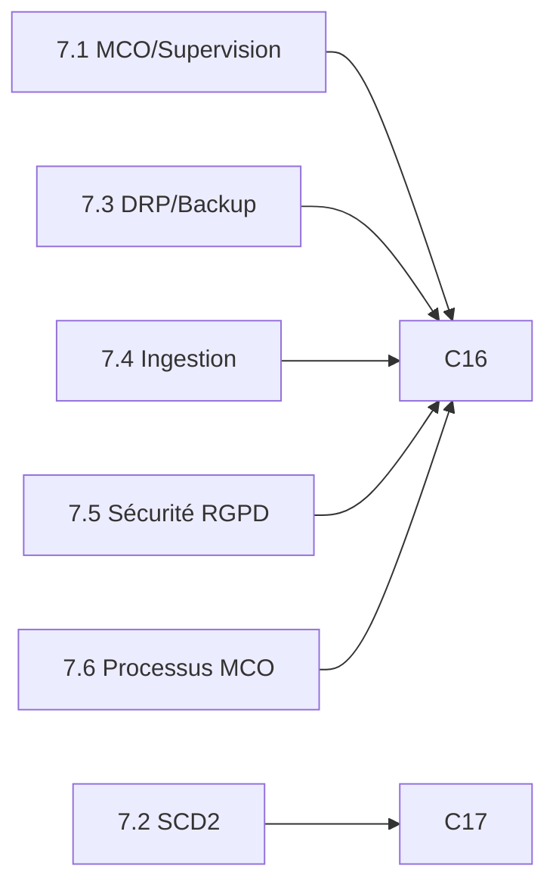

# Cartographie des situations professionnelles E6

## Vue d'ensemble

| # | Situation | Compétence | Artefacts principaux |
|---|-----------|------------|---------------------|
| 7.1 | MCO & Supervision | C16 | `monitoring/queries/`, `docs/05_socle_MCO/` |
| 7.2 | SCD2 & modélisation | C17 | `sql/scd2/`, `docs/06_SCD2/` |
| 7.3 | DRP & backups | C16 | `sql/backups/`, `docs/08_DRP/` |
| 7.4 | Ingestion streaming | C16 | `docs/10_pipelines/`, Stream Analytics |
| 7.5 | Sécurité & RGPD | C16 | `security/`, `docs/07_securite/` |
| 7.6 | Processus MCO (RACI) | C16 | `docs/05_socle_MCO/processus_MCO.md` |

## Couverture C16 / C17

## Liens vers le détail

- [Situation MCO](situations_MCO.md) — supervision, alerting, SLA
- [Situation SCD2](situations_SCD.md) — dim_vendor, procédure MERGE
- [Situation DRP](situations_DRP.md) — backup, restauration, RPO/RTO
- [Situation multi-sources](situations_multi_sources.md) — Event Hubs, Stream Analytics

## Correspondance grille jury

Voir [docs/12_validation_E6/correspondance_situations_competences.md](../12_validation_E6/correspondance_situations_competences.md) pour la matrice complète critères → artefacts.
