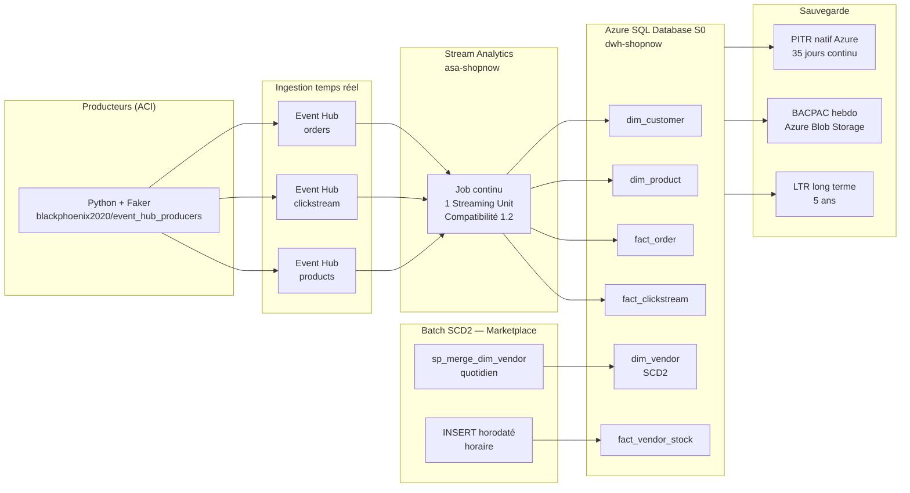
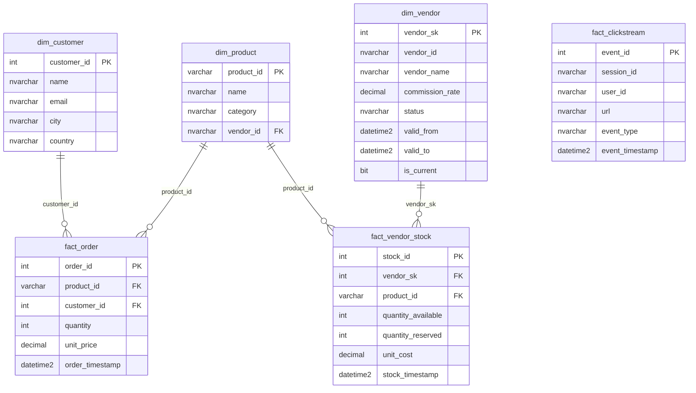

# Architecture globale — DWH ShopNow Marketplace

## Vue d'ensemble

---

## Composants déployés

| Composant | Nom Azure | Rôle |
|-----------|-----------|------|
| Resource Group | `rg-e6-sbuasa` | Conteneur de toutes les ressources |
| Event Hubs namespace | `eh-sbuasa` | Bus de messages — 3 hubs |
| Stream Analytics | `asa-shopnow` | Transformation + écriture temps réel |
| Azure SQL Server | `sql-server-rg-e6-sbuasa` | Moteur base de données |
| Azure SQL Database | `dwh-shopnow` (S0, 10 DTU) | Entrepôt de données |
| ACI producers | `aeh-producers` | Simulation de flux (Python + Faker) |
| Storage Account | `stshopnowbackup` | Stockage des BACPAC |
| IaC | Terraform azurerm v4.54.0 | Déploiement reproductible |

---

## Schéma de données

---

## Flux de données

| Flux | Source | Fréquence | Destination | Mécanisme |
|------|--------|-----------|-------------|-----------|
| Commandes | ACI Python | 60s | `fact_order` | Event Hub → Stream Analytics |
| Clickstream | ACI Python | 2s | `fact_clickstream` | Event Hub → Stream Analytics |
| Produits | ACI Python | 120s | `dim_product` | Event Hub → Stream Analytics |
| Vendeurs | Batch simulé | Quotidien | `dim_vendor` (SCD2) | `sp_merge_dim_vendor` |
| Stocks | Batch simulé | Horaire | `fact_vendor_stock` | INSERT horodaté |

---

## Choix d'architecture justifiés

| Décision | Choix | Alternative écartée | Raison |
|----------|-------|---------------------|--------|
| Ingestion temps réel | Stream Analytics | ADF + Databricks | Latence 2s requise pour clickstream |
| Base de données | Azure SQL S0 | SQL Managed Instance | MVP — 10 DTU suffisants, coût maîtrisé |
| SCD2 vendeurs | Procédure stockée `sp_merge_dim_vendor` | Pipeline ADF | Volume batch quotidien faible |
| Backup complet | BACPAC via `az sql db export` | `BACKUP TO DISK` | Azure SQL Database ne supporte pas BACKUP TO DISK |
| Producteurs | ACI (container) | Azure Functions | Simplicité déploiement Terraform |
