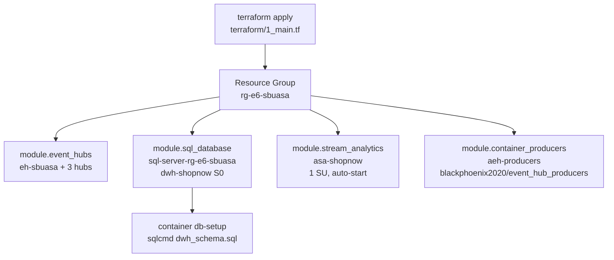

# Schéma de déploiement Terraform

## Structure des modules déployés

## Modules réels (terraform/modules/)

| Module | Ressources créées |
|--------|------------------|
| `event_hubs` | Namespace `eh-sbuasa` Basic + hubs orders/products/clickstream |
| `sql_database` | SQL Server + base `dwh-shopnow` S0 + firewall + container db-setup |
| `stream_analytics` | Job `asa-shopnow` 1 SU + inputs/outputs + démarrage automatique |
| `container_producers` | ACI `aeh-producers` restart=Always + variables d'env Event Hub |

## Corrections appliquées (vs dépôt initial)

| Fichier | Correction |
|---------|-----------|
| `terraform/1_main.tf` | `./modules/` → `../modules/` (×4 modules) |
| `terraform/1_main.tf` | `${path.root}/dwh_schema.sql` → `${path.root}/../dwh_schema.sql` |
| `terraform/terraform.tfvars` | `subscription_id` → `51a5ea3c-2ada-4f97-b2a1-a26eda3b14f2` |
| `terraform/terraform.tfvars` | `dockerhub_username` → `blackphoenix2020` |

Voir détail complet : [docs/09_terraform/plan_deploiement.md](../09_terraform/plan_deploiement.md)
