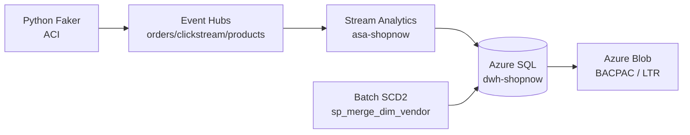

# Schéma Mermaid — Architecture complète

> Voir [architecture_globale.md](architecture_globale.md) pour le schéma complet avec ERD et flux de données.

## Flux simplifié

```mermaid
flowchart LR
    PY[Python Faker\nACI] --> EH[Event Hubs\norders/clickstream/products]
    EH --> ASA[Stream Analytics\nasa-shopnow]
    ASA --> SQL[(Azure SQL\ndwh-shopnow)]
    BATCH[Batch SCD2\nsp_merge_dim_vendor] --> SQL
    SQL --> BACKUP[Azure Blob\nBACPAC / LTR]
```
