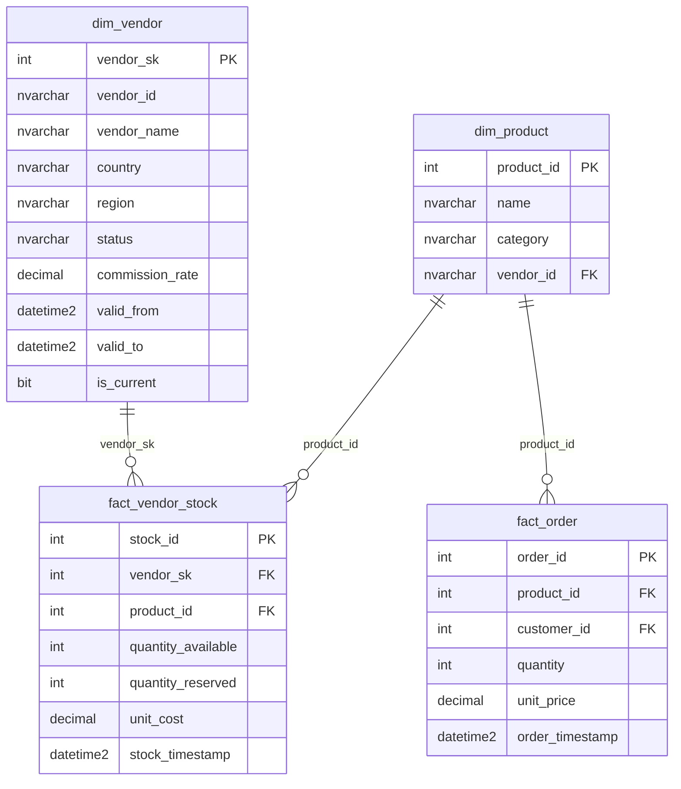

# Modélisation SCD Type 2 — dim_vendor

## Contexte

Le pivot de ShopNow vers un modèle Marketplace multi-vendeurs (C17) nécessite
l'introduction d'une nouvelle dimension `dim_vendor` avec gestion historique
des changements d'attributs — **SCD Type 2 (Slowly Changing Dimension)**.

## Principe du SCD2

Un SCD2 conserve **toutes les versions** d'un enregistrement dans le temps.
Chaque changement d'attribut tracké crée une nouvelle ligne, l'ancienne étant
"fermée" avec une date de fin.

```
vendor_id  vendor_name       commission_rate  valid_from   valid_to     is_current
V001       TechGadgets SAS   12.50            2026-01-01   2026-03-12   0
V001       TechGadgets SAS   14.00            2026-03-12   NULL         1
```

La clé de substitution (`vendor_sk`) est **immuable** — c'est elle qui est
référencée dans les tables de faits.

## Modèle de données C17



## Attributs trackés vs non trackés

| Attribut | Tracké SCD2 | Raison |
|----------|-------------|--------|
| `commission_rate` | Oui | Impact financier — historique requis |
| `status` | Oui | Suspension/réactivation = événement métier |
| `country` / `region` | Oui | Changement de périmètre géographique |
| `vendor_name` | Oui | Renommage = changement d'entité |
| `vendor_email` | Non | Contact opérationnel, pas d'impact analytique |

## Scripts d'implémentation

| Script | Rôle |
|--------|------|
| [`dim_vendor_create.sql`](../../sql/scd2/dim_vendor_create.sql) | Création table + index + données démo |
| [`dim_vendor_merge.sql`](../../sql/scd2/dim_vendor_merge.sql) | Procédure `sp_merge_dim_vendor` — logique SCD2 |
| [`fact_vendor_stock.sql`](../../sql/scd2/fact_vendor_stock.sql) | Table de faits stocks + vue analytique |
| [`dim_product_update.sql`](../../sql/scd2/dim_product_update.sql) | Enrichissement dim_product (vendor_id FK) |

## Requête type — analyse historique SCD2

```sql
-- Historique complet des changements de commission pour un vendeur
SELECT
    vendor_id,
    vendor_name,
    commission_rate,
    valid_from,
    ISNULL(CONVERT(NVARCHAR(20), valid_to), 'en cours') AS valid_to,
    is_current
FROM dbo.dim_vendor
WHERE vendor_id = 'V001'
ORDER BY valid_from;
```
