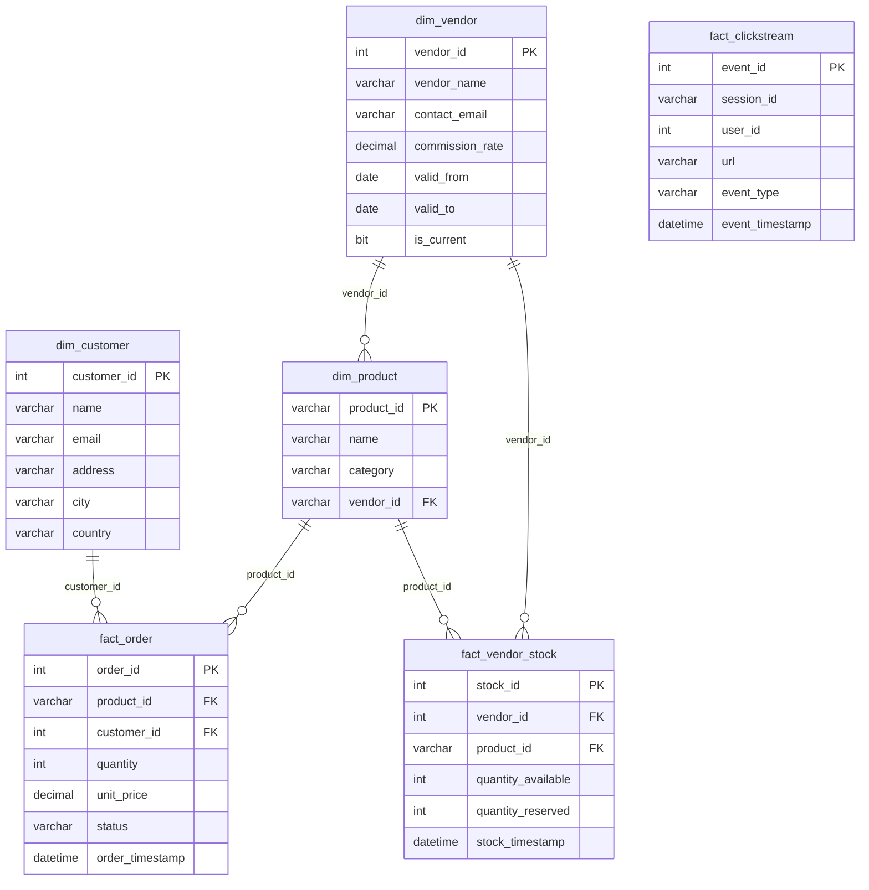

# Schéma DWH enrichi — Post Marketplace

## Évolution du modèle

L'ouverture Marketplace a nécessité l'ajout de deux nouvelles entités et l'enrichissement de `dim_product`.

---

## Schéma cible

---

## Entités ajoutées (Marketplace)

| Entité | Type | Rôle |
|--------|------|------|
| `dim_vendor` | Dimension SCD2 | Suivi historique des vendeurs et commissions |
| `fact_vendor_stock` | Table de faits | Disponibilité stock par vendeur/produit |

## Enrichissement `dim_product`

- Ajout colonne `vendor_id INT` → FK vers `dim_vendor`
- 972 produits mis à jour — 0 sans vendeur après migration
- Index filtré `idx_product_vendor` sur `vendor_id IS NOT NULL`

---

## Compatibilité ascendante

Les tables existantes (`fact_order`, `fact_clickstream`, `dim_customer`) n'ont pas été modifiées. Les pipelines streaming sont inchangés.
