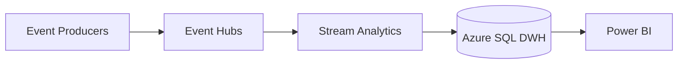

## Architecture actuelle
- Dimensions : dim_customer, dim_product
- Facts : fact_order, fact_clickstream
- ETL internes + Event Hubs pour flux temps réel
- Modèle mono-vendeur

## Limites identifiées

| Axe           | Limite                                    |Impact
| ------------- | ------------------------------------------|-------------------------------------------|
| Structure     | Pas de dimension vendeur                  |Impossible de suivre les vendeurs tiers    |
| Historisation | Pas de SCD2                               |Historique non conservé                    |
| Sources       | Uniquement flux internes                  |Intégration de nouvelles sources complexe  |
| Qualité       | Aucun score vendeur, ni table d'anomalies |Risque sur KPIs (conversion, stock, erreurs)|
| Sécurité      | Pas de RLS multi-vendeur                  |Pas de cloisonnement par vendeur |
| MCO           | Monitoring limité, pas d’alerting SLA     |
| Backups       | Pas de DRP documenté                      |Pertes de données critiques
