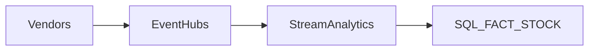

# Pipelines et ingestion multi-sources


---

Il manque le multi-sources

## Pipelines (batch, API, streaming)

### 1. Batch fichiers vendeurs
- Polling SFTP / Storage Trigger  
- ADF → Raw → Clean → Curated  

### 2. API vendeurs
```python
GET /vendors/{id}/stock
```
### 3. Streaming(stock en temps réel)
- Azure Function wrapper
- ADF ingestion orchestrée



| Type de flux | Action | Ressources | Statut |
|--------------|--------|------------|--------|
| Fichiers CSV/JSON/Excel | Ingestion, normalisation | ADF, Storage Event Triggers | [ ] |
| API vendeurs | Appels REST, ingestion | ADF, Azure Functions | [ ] |
| Streaming | Event Hubs → Stream Analytics → DWH | Event Hubs, Stream Analytics | [ ] |
| Normalisation | Schéma multi-vendeur | Databricks / Synapse | [ ] |
