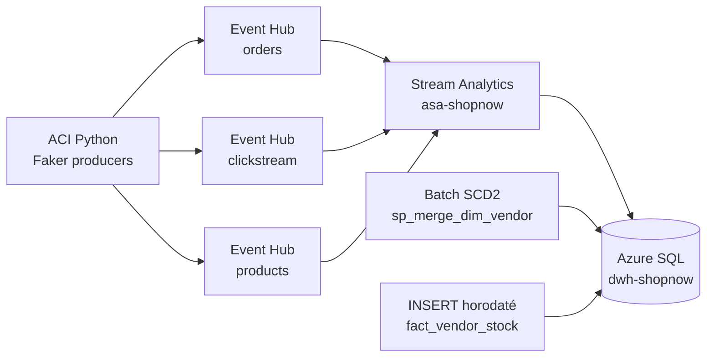

# Pipelines d'ingestion — Architecture réelle

---

## Architecture hybride streaming + batch

---

## Flux temps réel (Stream Analytics)

| Flux | Source | Fréquence | Destination | Statut |
|------|--------|-----------|-------------|--------|
| Commandes | ACI Python / Event Hub `orders` | 60s | `fact_order` | [x] Fait |
| Clickstream | ACI Python / Event Hub `clickstream` | 2s | `fact_clickstream` | [x] Fait |
| Produits | ACI Python / Event Hub `products` | 120s | `dim_product` | [x] Fait |

Statut vérifié 2026-03-12 : Stream Analytics `asa-shopnow` → **Running**, ACI `aeh-producers` → **Running**

---

## Flux batch SCD2 (Marketplace)

| Flux | Mécanisme | Fréquence | Destination | Statut |
|------|-----------|-----------|-------------|--------|
| Vendeurs | `sp_merge_dim_vendor` (3 cas MERGE) | Quotidien | `dim_vendor` (SCD2) | [x] Fait |
| Stocks | INSERT horodaté | Horaire | `fact_vendor_stock` | [x] Fait |

---

## Choix techniques justifiés

| Besoin | Solution implémentée | Alternative écartée | Raison |
|--------|---------------------|---------------------|--------|
| Latence clickstream 2s | Stream Analytics | ADF (min 15 min batch) | Latence temps réel requise |
| SCD2 vendeurs batch | Procédure stockée SQL | ADF + Mapping Data Flow | Volume faible, MERGE natif SQL |
| Stocks horaires | INSERT-only horodaté | Table de staging | Auditabilité complète |

---

## Documentation technique

- [Event Hubs — configuration](../../docs/10_pipelines/eventhubs_ingestion.md)
- [Stream Analytics — jobs et requêtes](../../docs/10_pipelines/streamanalytics_jobs.md)
- [Pipelines batch SCD2](../../docs/10_pipelines/datafactory_pipelines.md)
